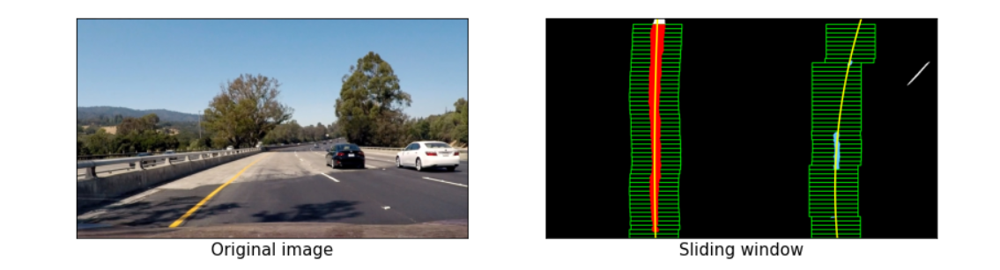

# Simple-Perception-Stack-for-Self-Driving-Cars
In this project we are going to create a simple perception stack for self-driving cars (SDCs.) Although a typical perception stack for a self-driving car may contain different data sources from different sensors (ex.: cameras, lidar, radar, etc…), we’re only going to be focusing on video streams from cameras for simplicity. We’re mainly going to be analyzing the road ahead, detecting the lane lines, detecting other cars/agents on the road, and estimating some useful information that may help other SDCs stacks. The project is split into two phases. We’ll be going into each of them in the following parts.

## Pipeline architecture
1-Compute Camera Calibration.
2-Apply Distortion Correction.
3-Apply a Perspective Transform.
4-Create a Thresholded Binary Image.
5-Define the Image Processing Pipeline.
6-Detect Lane Lines.
7-Determine the Curvature of the Lane and Vehicle Position.
8-Visual display of the Lane Boundaries and Numerical Estimation of Lane Curvature and Vehicle Position.
9-Process Project Videos.

## Camera Calibration
we need to calibrate camera as our test video have curved lanes so to use Distortion Correction we need to know camera parameters
using openCV functions cv2.findChessboardCorners() and cv2.drawChessboardCorners() are used for image calibration

## Apply Distortion Correction

## Apply a Perspective Transform
convert the vehicle’s camera view of the scene into a top-down “bird’s-eye” view

## Create a Thresholded Binary Image
using color space for lane detection

### LAB Color Space
The Lab color space describes mathematically all perceivable colors in the three dimensions L for lightness and a and b for the color opponents green–red and blue–yellow.

### HLS color space
This model was developed to specify the values of hue, lightness, and saturation of a color in each channel. The difference with respect to the HSV color model is that the lightness of a pure color defined by HLS is equal to the lightness of a medium gray, while the brightness of a pure color defined by HSV is equal to the brightness of white.

## Color Space Thresholding
the white lane lines are clearly highlighted in the L-channel of the of the HLS color space, and the yellow line are clear in the B-channel of the LAP color space as well. We'll apply HLS L-threshold and LAB B-threshold to the image to highlight the lane lines.

## Image Processing Pipeline
Distortion Correction then Perspective Transform thenColor Thresholding

## Detect the Lane Lines
we still need to decide explicitly which pixels are part of the lines and which belong to the left line and which belong to the right line

### Sliding Window Search
We'll compute a histogram of the bottom half of the image and find the base of the left and right lane lines. Originally these locations were identified from the local maxima of the left and right halves of the histogram, but in the final implementation we used quarters of the histogram just left and right of the midpoint. This helped to reject lines from adjacent lanes. The function identifies 50 windows from which to identify lane pixels, each one centered on the midpoint of the pixels from the window below. This effectively "follows" the lane lines up to the top of the binary image, and speeds processing by only searching for activated pixels over a small portion of the image

## Polyfit Using Fit from Previous Frame
The Polyfit Using Fit from Previous Frame is another way that performs basically the same task, but alleviates much difficulty of the search process by leveraging a previous fit (from a previous video frame, for example) and only searching for lane pixels within a certain range of that fit.

## Visual display of the Lane Boundaries

## Lane Curvature and Vehicle Position from center of the lane
The curvature was calculated ussing this line of code:

curve_radius = ((1 + (2*fit[0]*y_0*y_meters_per_pixel + fit[1])**2)**1.5) / np.absolute(2*fit[0])

In this example, fit[0] is the first coefficient (the y-squared coefficient) of the second order polynomial fit, and fit[1] is the second coefficient. y_0 is the y position within the image upon which the curvature calculation is based. y_meters_per_pixel is the factor used for converting from pixels to meters. This conversion was also used to generate a new fit with coefficients in terms of meters.

The position of the vehicle with respect to the center of the lane is calculated with the following lines of code:

lane_center_position = (r_fit_x_int + l_fit_x_int) /2 center_dist = (car_position - lane_center_position) * x_meters_per_pix

r_fit_x_int and l_fit_x_int are the x-intercepts of the right and left fits, respectively. This requires evaluating the fit at the maximum y value because the minimum y value is actually at the top. The car position is the difference between these intercept points and the image midpoint (assuming that the camera is mounted at the center of the vehicle)

## Writting Vheicle Position and Lane Curvature

## Process Project Videos
using moviepy library

# Hint all Pictures and Videos for tests are provided in Jupyter Notebook

# 2nd phase Vehicle Detection

The Project
---

The goals / steps of this project are the following:

* Perform a Histogram of Oriented Gradients (HOG) feature extraction on a labeled training set of images and train a classifier Linear SVM classifier
* Implement a sliding-window technique and use your trained classifier to search for vehicles in images.
* Run your pipeline on a video stream (start with the test_video.mp4 and later implement on full project_video.mp4) and create a heat map of recurring detections frame by frame to reject outliers and follow detected vehicles.
* Estimate a bounding box for vehicles detected.

[//]: # (Image References)

[image1]: ./output_images/car_samples.png "Car Samples"
[image3]: ./output_images/non_car_samples.png "Non-car Samples"
[image4]: ./output_images/HOG_comparison.png "HOG Comparison"
[image5]: ./output_images/bbox_vis.png "Region Proposal Visualisation"
[image6]: ./output_images/heatmap.png "Heatmap"
[image7]: ./output_images/video_thumbnail.jpg "Video Thumbnail"

Here are links to the labeled data for [vehicle](https://s3.amazonaws.com/udacity-sdc/Vehicle_Tracking/vehicles.zip) and [non-vehicle](https://s3.amazonaws.com/udacity-sdc/Vehicle_Tracking/non-vehicles.zip) examples provided by Udacity.  These example images come from a combination of the [GTI vehicle image database](http://www.gti.ssr.upm.es/data/Vehicle_database.html), the [KITTI vision benchmark suite](http://www.cvlibs.net/datasets/kitti/).

## Basic Summary of Dataset
We begin in Vehicle_Detector.ipynb cell 3, with a summary of the provided dataset:

No. of car images:  8792

No of non-car images:  8968

Image shape:  (64, 64, 3)

The dataset is fairly balanced.

### Car Image Examples
![alt_text][image1]

### Non-car Image Examples
![alt_text][image3]

## Feature Extraction Method
Methods for feature extraction are created in cell 6. This is code previously prepared
during the Udacity lecture. 

`bin_spatial()` computes binned colour features by scaling images down.

`color_hist()` computes colour histogram features.

`get_hog_features()` returns HOG features and visualisation.

`extract_features()` wraps and combines the above functions.

## HOG Visualisation
![alt_text][image4]

After experimenting different color spaces and using different channels, I choose to use all the YCrCb color channels as it resulted in the highest accuracy in the classifier (cell 11).

One might be tempted to tune the parameters optimising purely for accuracy. However, I had to consider the computational complexity of the chosen parameters. More pixels per cell and more cells per block could result in tighter boxes, but also in higher computational complexity. The resulting parameters chosen were found by trial annd error, and appear to be a cursory sweetspot given the processor on my laptop.

## Data Preparation
I felt the dataset was large enough, and did not require further augmentation for this relatively simple classifier.
In cell 9 we apply a scaler to the feature vector, and split the data into training/validation sets.

## Classifier
In cell 11 I run the classifier on the dataset with a 0.989 accuracy. There is a chance of overfitting here,
but its effects proved to be acceptable for the purposes of this exercise.

## Sliding Window Search
In cell 14, one can find the HOG window search routine. This is a region proposer that scans select portions of the image
and checks for presence of a vehicle. The cell size and cell position are determined by the way the road is laid out, and the
distance of vehicles from the camera. 

An example is shown below, where the window search is told to look. Smaller search area farther away is given smaller cells to search within, given that cars appear smaller further away.

![alt_text][image5]

It is immediately apparent that the search area includes portions unlikely to contain vehicles (like left of the highway barrier). Regardless, it makes sense to include this search region as the driver could choose to drive in the middle lane instead.
 
## Temporal Heatmapping
I introduced a heatmap of successful hits in the frame. The outputs of this heatmap are recorded and added to a queue of length n in `detect_history()` (cell 16). 

By using this queue, I'm able to smooth my bounding boxes between frames. This step helps reduce false positives that would be mis-classified over consecutive frames. The result is improved accuracy and a smoother overall result.

Below is the visualization of the heatmap next to the resulting bounding boxes.

![alt_text][image6]

## Final Pipeline
All that's left to do now is to process the entire video. Here is it on Youtube.
[![Vehicle Detection][image7]](https://www.youtube.com/watch?v=zNlnjWxU6DM&feature=youtu.be "Vehicle Detection Video")

## Conclusion
This algorithm is not a fast one - it appears to take 15 minutes on my (slow) laptop. Finding a sweet spot between accuracy and computational speed was a challenge. I suppose given that the video already takes 15 minutes, hope for this implementation to achieve real-time speeds would be a long shot.
